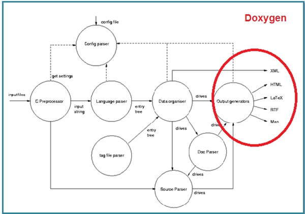

Hacking CompilerKit
===================
## Status
- [Ohloh tracker](https://www.ohloh.net/p/CompilerKit)

## Getting started
1. Install the dependencies (Git, CMake, Doxygen, GLib, GObject, C compiler) for your platform.

   - [Windows](#what-to-install-on-windows)
   - [Linux](#what-to-install-on-linux)
   - [Mac](#what-to-install-on-mac)

2. [Fork the project here.](https://github.com/lawrancej/CompilerKit/fork)

         git clone https://github.com/YourNameGoesHereButDontTypeThisInLiterally/CompilerKit.git
         cd CompilerKit
         git submodule init # This project has submodules in it, so do this first (one time).
         git submodule update # This project has submodules in it, so do this first (one time).

3. Add me as upstream, and add in your collaborators, too.

         git remote add upstream https://github.com/lawrancej/CompilerKit.git
         ./collaborators.sh setup

4. [Build CompilerKit.](#how-do-i-build-compilerkit)

        ./generate.sh build # Builds tests only
        ./generate.sh build -DBUILD_EXAMPLES=ON # Builds all examples
        ./generate.sh build -DBUILD_SCANNER_DEMO=ON # Builds the scanner demo only

5. [Read Documentation.](#where-is-the-documentation)

        ./generate.sh docs

6. [Learn how to contribute.](#how-to-contribute)

        git pull upstream master          # Get the latest and greatest.
        git checkout -b issueXYZ          # Work on an issue in a new topic branch, based off of the upstream master branch.
        ... Hack away ...                 # Your new code compiles and the tests pass, right?
        git commit -a -m "Fixed issueXYZ" # Great! Commit your changes.
        git push origin issueXYZ          # Push your changes to your repo. Send in a pull request.
        git checkout master               # Switch back to master. Rinse and repeat.

## What to install on Windows
You will need to download and install everything manually.
Therefore, verify everything is working first before building CompilerKit.

 - Visual Studio 2010 or [MinGW](http://sourceforge.net/projects/mingw/files/latest/download?source=files)
 - [Git (version control).](http://git-scm.com/downloads)
 - [CMake.](http://www.cmake.org/cmake/resources/software.html)
 - [Doxygen.](http://www.stack.nl/~dimitri/doxygen/download.html#latestsrc)
 - [GLib and GObject.](http://ftp.gnome.org/pub/gnome/binaries/win32/gtk+/2.24/gtk+-bundle_2.24.10-20120208_win32.zip) Extract to `C:\glib`. Add `C:\glib\bin` to the system PATH.
 - [GrahpViz.](http://www.graphviz.org/Download_windows.php)
 - [StarUML](http://staruml.sourceforge.net/en/) to examine UML diagrams. We should switch to cross-platform [Dia](http://dia-installer.de/index.html.en), since StarUML only works on Windows.

### How do I know it's working?
Open Git Bash to the `CompilerKit` folder. Type in the first line. Did you see the rest? You should.
```
pkg-config --list-all
gio-2.0               GIO - glib I/O library
gmodule-2.0           GModule - Dynamic module loader for GLib
glib-2.0              GLib - C Utility Library
gmodule-no-export-2.0 GModule - Dynamic module loader for GLib
gthread-2.0           GThread - Thread support for GLib
gobject-2.0           GObject - GLib Type, Object, Parameter and Signal Library
```

Did you see `command not found` after typing these into Git Bash? You should not.

 - `doxygen`
 - `cmake`

### How do I get rid of those annoying debug messages during testing?

1. Open `regedit`
2. Navigate to the following location and select `Windows Error Reporting`:

       HKEY_LOCAL_MACHINE\Software\Microsoft\Windows\Windows Error Reporting

3. Select `Edit -> New -> DWORD (32-bit value)`
4. Replace `New Value #1` with `DontShowUI`
5. Double click `DontShowUI`. Enter `1` for value data. Click OK.
6. Exit `regedit`

### How do I build using MSYS?
If you installed MSYS, do the following to build all the examples:

    ./generate.sh build -G '"MSYS Makefiles"' -DBUILD_EXAMPLES=ON

## What to install on Linux
In the terminal, paste this in for your distribution:

### Red Hat:

    sudo yum install git cmake doxygen glib-devel pkgconfig 'graphviz*'

### Debian, Ubuntu:

    sudo apt-get install git cmake doxygen libglib2.0-dev pkg-config graphviz

## What to install on Mac
If you do not already have it, install:

 - [Command Line Tools for Xcode](https://developer.apple.com/downloads) or [Xcode](http://itunes.apple.com/us/app/xcode/id448457090)
 - [Java Developer Update](https://connect.apple.com)
 - [GraphViz](http://www.graphviz.org/Download_macos.php)

In the terminal, paste this in:

    /usr/bin/ruby -e "$(/usr/bin/curl -fsSL https://raw.github.com/mxcl/homebrew/master/Library/Contributions/install_homebrew.rb)"
    
Once installed, paste this into the Terminal:

    brew install git cmake doxygen glib pkg-config

### Troubleshooting
If you see the following error when using CMake on the Mac:

```
build User$ cmake ..
CMake Error: CMake was unable to find a build program corresponding to "Unix Makefiles". CMAKE_MAKE_PROGRAM is not set. You probably need to select a different build tool.
CMake Error: Error required internal CMake variable not set, cmake may be not be built correctly.
Missing variable is:
CMAKE_C_COMPILER_ENV_VAR
CMake Error: Error required internal CMake variable not set, cmake may be not be built correctly.
Missing variable is:
CMAKE_C_COMPILER
CMake Error: Could not find cmake module file:/Users/User/CompilerKit/build/CMakeFiles/CMakeCCompiler.cmake
CMake Error: CMAKE_C_COMPILER not set, after EnableLanguage
-- Configuring incomplete, errors occurred!
```

Follow these steps to fix the error:

1.	Open XCode
2.	Go to Preferences
3.	Download tab
4.	Install Command line

## How do I build CompilerKit?
Easy! Type this in:

    ./generate.sh build

If you get build errors that you know shouldn't be there, try rebuild:

    ./generate.sh rebuild

To run the test suite, type:

    ./generate.sh test

To get a coverage report, type this (if on MSYS, [do this first](#how-do-i-build-using-msys)):

    ./generate.sh coverage

## Where is the documentation?
[CompilerKit uses Doxygen](#what-is-doxygen) to generate documentation. Do this to generate and view documentation:

    ./generate.sh docs

Also, read up on [GLib](#how-do-i-use-glib) and [GObject](#how-do-i-use-gobject).

## What is Doxygen?
Doxygen generates documentation in HTML, LaTeX, RTF (MS-Word) using specially-formatted comments.
It can also extract the code structure from undocumented source files for many programming languages (C/C++, Java, Python, etc).

Example comment:
```
/**
 * compilerkit_visitor_register:
 * @fn compilerkit_visitor_register
 * @memberof CompilerKitVisitor
 * Associate the GType of a class with a visitor function.
 * @pre CompilerKitVisitor* is not NULL.
 * @param CompilerKitVisitor* The visitor instance.
 * @param GType The type of the class to visit.
 * @param CompilerKitVisitorFunc A pointer to a visitor function for the specified type.
 * @return void
 */
```



## How to contribute
### Know thy code layout
The folder structure of CompilerKit is as follows:

```
.boilerplate        Contains boilerplate classes for writing new GObject classes.
AUTHORS             A list of people who contribute to the project.
CMakeLists.txt      CMake configuration file for generating Makefiles.
CONVENTIONS.md      How to write code without looking stupid.
COPYING             The license (LGPL 2.1+)
Doxyfile            Doxygen configuration.
HACKING.md          This file.
README.md           The readme.
TODO.md             A list of TODO items.
build/              Where the build goes (git ignores this)
collaborators.sh    Configure git to add all AUTHORS into your git remotes for you
dependencies/       A folder containing project dependencies. Currently, just the latest from lcov CVS.
docs/               All generated documentation goes there. Read it!
examples/           Source code demonstrations for how to use each class. Shows up in the documentation.
generate.sh         The Swiss-Army knife: it does everything.
images/             Miscellaneous images in project documentation
include/            The include files for the CompilerKit library.
src/                The CompilerKit library source code.
tests/              The test suite to exercise the CompilerKit library.
```

The regex classes are: `CompilerKitSymbol`, `CompilerKitEmptySet`, `CompiletKitEmptystring`, `CompilerKitConcatenation`, `CompilerKitAlternation`, `CompilerKitKleeneStar`, `CompilerKitComplement`.

The cfg classes are: `CompilerKitGrammar`, `CompilerKitTerminal`, `CompilerKitNonterminal`, `CompilerKitProduction`.

### Find (or open) an issue to work on
We use github's issue tracker to manage our participation:

 - [Work on open issues in github's issue tracker](https://github.com/lawrancej/CompilerKit/issues) (comment on issues to get dibs).
   * Pro tip: pair up and split the work on an issue with someone else. E.g., you test and document, they implement.
 - [Open new issues.](https://github.com/lawrancej/CompilerKit/issues/new)
   * Write test cases for inadequately covered code (see existing test cases for ideas).
   * Improve the documentation (see existing documentation for ideas).

### Review contributions
[Review code, tests, and documentation for quality issues (comment on pull requests).](https://github.com/lawrancej/CompilerKit/pulls)

 * Does the code compile and make sense?
 * Did it handle all cases? Check the coverage report.

### Use topic branches for your work
Topic branches isolate chunks of work so that it's easier to merge in changes.
Here's how it works:

```
git pull upstream master
git checkout -b issueXYZ # Create a new local branch issueXYZ
... Hack away ...
git commit -a -m "Work in progress on issueXYZ"
git push origin issueXYZ # Push local branch to remote repo
git checkout master
```

### Test your changes
I will not merge code into my master branch until:

 - The [project builds successfully.](#how-do-i-build-compilerkit)
 - It has a demo (see `examples/`).
 - Test cases pass in the test suite (see `tests/test.c` and `tests/test.h`)
 - [The documentation looks as expected](#where-is-the-documentation).

Look for the demo and test suite executables in these folders:

 - `build/Debug` (Windows)
 - `build` (Mac, Linux)

### Send in a pull request for feedback
Switch to your branch in github, and [send in a pull request](https://github.com/lawrancej/CompilerKit/pull/new/master) that describes what you did.
Do so when you think your changes are ready to be merged in. But do not hesitate to push works in progress.

## How do I use GLib?
GLib is a C utility library similar to the Standard Template Library in C++. It provides data structures as well as [GObject](#how-do-i-use-gobject).

To use it, read these first:

* [Documentation for GLib](http://developer.gnome.org/glib/stable/)
* [GLib Hash table tutorial](http://www.ibm.com/developerworks/linux/tutorials/l-glib/section5.html)

## What do the GObject macros mean?
Let's compare with some examples.

```
GObject                                Java/C#
(prefix everything with COMPILERKIT)   package CompilerKit;
COMPILERKIT_IS_ALTERNATION(obj)        (obj instanceof Alternation)
COMPILERKIT_ALTERNATION (obj)          (Alternation) obj
COMPILERKIT_TYPE_ALTERNATION           Alternation.class
G_OBJECT_TYPE (obj)                    obj.getClass()
compilerkit_alternation_get_left(alt)  alt.getLeft()
```

## How do I use GObject?
GObject may seem intimidating. Learn how it works, and realize that OOP languages provide a lot of shortcuts that C exposes to the programmer.

To use GObject, read these first:

* [GObject Tutorial](http://syscall.org/doku.php/gobjectutorial/start)
* [GObject FAQ](http://web.archive.org/web/20101115164311/http://irrepupavel.com/documents/gtk/gobject-faq.html)
* [GObject Documentation](http://developer.gnome.org/gobject/stable/)

## How do I write GObject classes?
Run `./generate.sh`, and follow the instructions.
